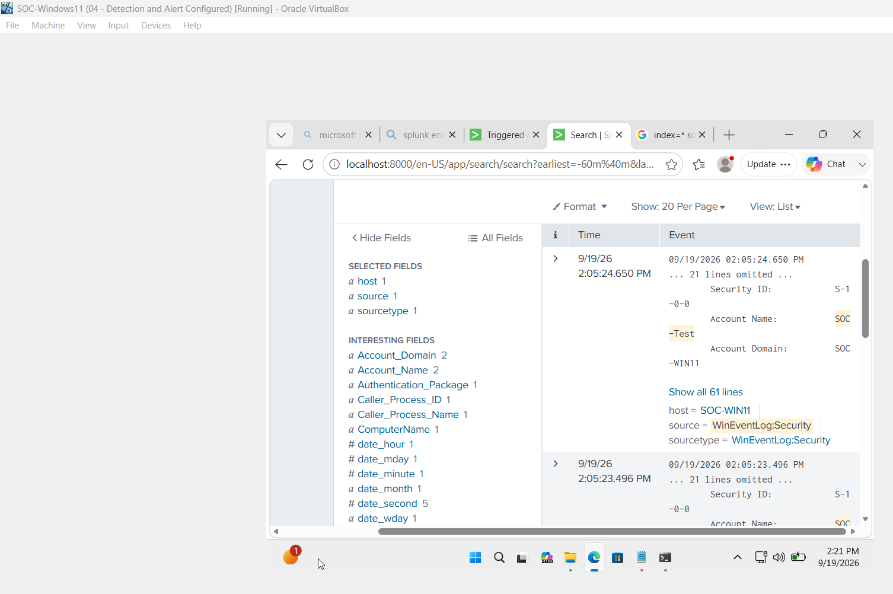
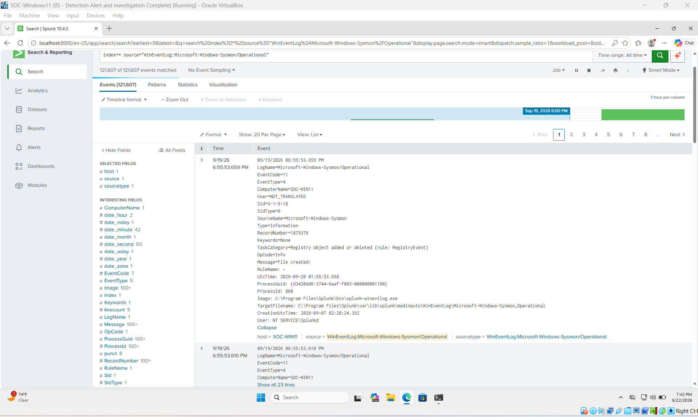
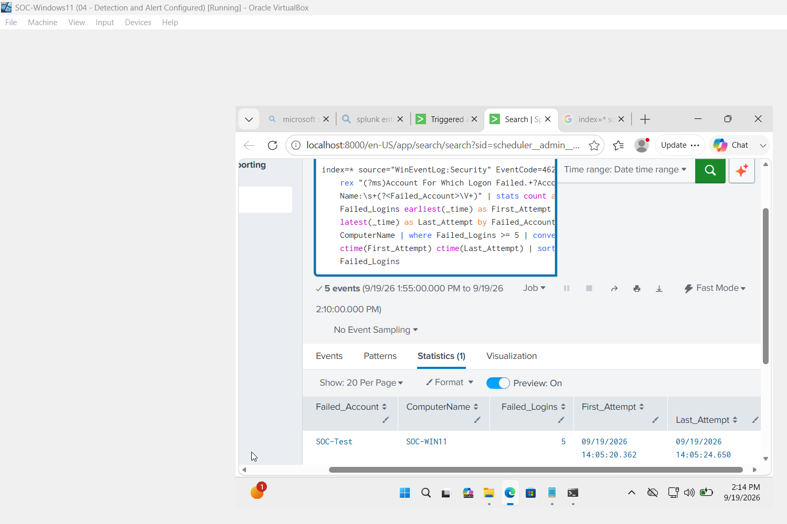
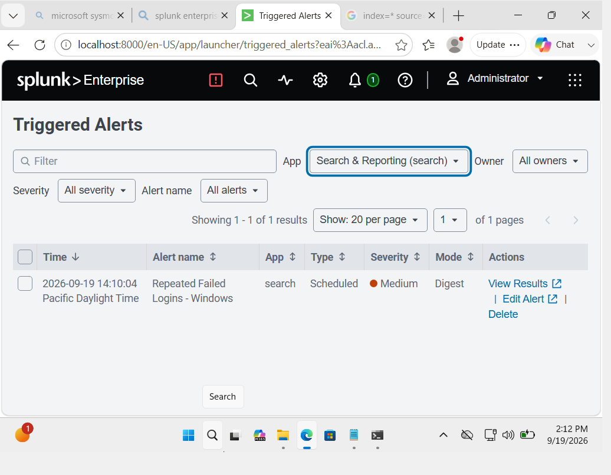
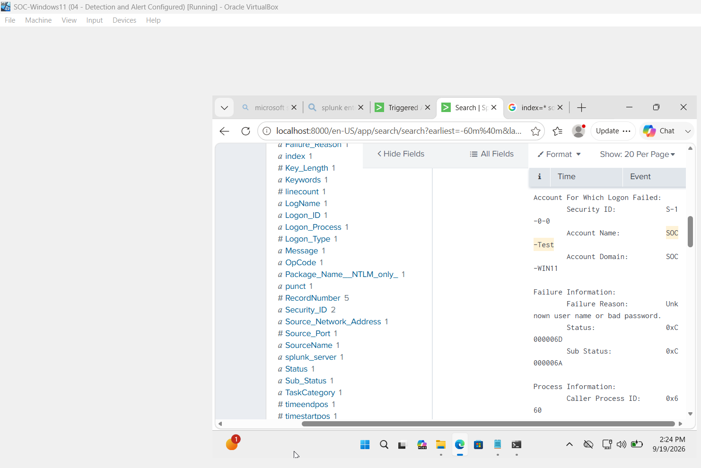
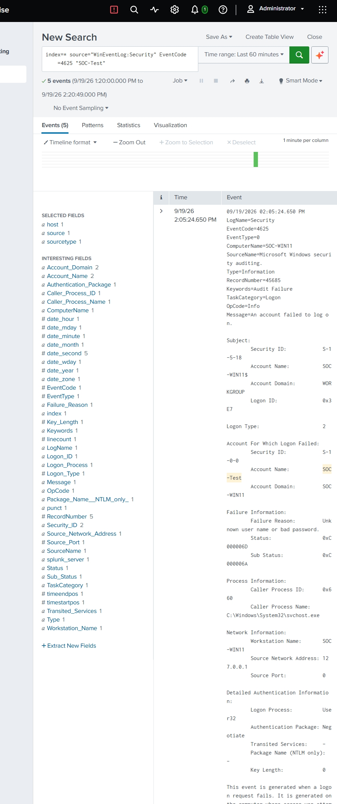
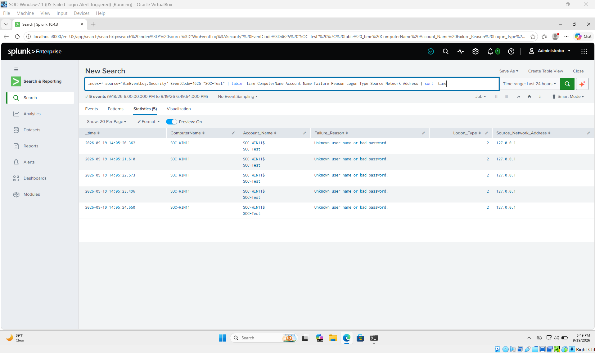

# SOC Home Lab — Splunk SIEM Detection & Investigation

A hands-on Security Operations Center (SOC) home lab built to practice log collection, SIEM monitoring, detection engineering, alerting, investigation, and incident response using Splunk Enterprise, Windows Security logs, and Sysmon.

## Project Overview

This project simulates a Tier 1 SOC workflow in a controlled Windows lab environment. A Windows 11 endpoint sends Windows Security and Sysmon telemetry to Splunk Enterprise, where the logs can be searched, analyzed, and used to create security detections.

For the first detection scenario, repeated failed Windows logon attempts were generated against a test account. A Splunk detection identified five failed authentication attempts, triggered a scheduled alert, and the resulting Windows Event ID 4625 activity was investigated.

> All suspicious activity shown in this project was intentionally generated in an isolated lab environment for educational purposes.

## Lab Environment

| Component | Purpose |
| --- | --- |
| Windows 11 Enterprise | Monitored endpoint |
| VirtualBox | Virtualization platform |
| Splunk Enterprise | SIEM and log analysis |
| Windows Security Logs | Authentication and security telemetry |
| Sysmon | Enhanced Windows endpoint telemetry |

**Endpoint:** `SOC-WIN11`

**Test account:** `SOC-Test`

## Log Collection

Windows Security logs were ingested into Splunk to provide visibility into authentication activity on the endpoint.



Sysmon was also configured on the Windows endpoint and its Operational event channel was ingested into Splunk.



## Detection Scenario — Repeated Failed Logons

Five incorrect password attempts were intentionally generated against the `SOC-Test` account.

The activity produced Windows Security **Event ID 4625 — An account failed to log on**.

A Splunk detection was created to identify accounts generating five or more failed logons within the search window.

```spl
index=* source="WinEventLog:Security" EventCode=4625
| rex "(?ms)Account For Which Logon Failed.+?Account Name:\s+(?<Failed_Account>\V+)"
| stats count as Failed_Logins earliest(_time) as First_Attempt latest(_time) as Last_Attempt by Failed_Account ComputerName
| where Failed_Logins >= 5
| convert ctime(First_Attempt) ctime(Last_Attempt)
| sort - Failed_Logins
```

The detection identified:

- **Account:** `SOC-Test`
- **Endpoint:** `SOC-WIN11`
- **Failed logons:** 5



## Alerting

The detection was configured as a scheduled Splunk alert.

**Alert:** `Repeated Failed Logins - Windows`

**Schedule:** Every 5 minutes

**Search window:** Last 5 minutes

**Trigger condition:** Number of results greater than 0

**Severity:** Medium

After five new failed authentication attempts were generated, the alert successfully triggered.



The alert results showed five failed logon attempts against `SOC-Test` on `SOC-WIN11`.



## Investigation

The underlying Windows Security events were reviewed in Splunk to determine what occurred.

A representative Event ID 4625 showed:

- **Target account:** `SOC-Test`
- **Computer:** `SOC-WIN11`
- **Logon Type:** `2` (Interactive)
- **Failure reason:** Unknown user name or bad password
- **Status:** `0xC000006D`
- **Sub Status:** `0xC000006A`
- **Source Network Address:** `127.0.0.1`
- **Logon Process:** `User32`
- **Authentication Package:** `Negotiate`

The evidence was consistent with repeated local interactive password attempts against the test account.



The five failed attempts occurred within several seconds of one another, providing a clear timeline of the simulated password-guessing activity.



## MITRE ATT&CK Mapping

The simulated activity was mapped to:

**Tactic:** Credential Access  
**Technique:** Brute Force — Password Guessing  
**Technique ID:** `T1110.001`

## Investigation Findings

The investigation determined that:

- Five failed authentication attempts targeted the same local account.
- The attempts occurred within a short period.
- The events originated from the local endpoint (`127.0.0.1`).
- Logon Type 2 indicated interactive authentication attempts.
- The Windows status information indicated incorrect-password attempts.
- The activity was intentionally generated as part of the controlled SOC lab.

No actual account compromise occurred during the simulation.

## Response Recommendations

In a production environment, similar activity should prompt an analyst to:

- Review the source and frequency of failed authentication attempts.
- Determine whether the activity is expected or suspicious.
- Check for successful authentication following repeated failures.
- Review related endpoint and authentication telemetry.
- Apply appropriate account lockout and password policies.
- Use multi-factor authentication where applicable.
- Escalate or contain the affected account or endpoint when evidence indicates malicious activity.

## Skills Demonstrated

- SIEM monitoring with Splunk Enterprise
- Windows Security log analysis
- Sysmon telemetry collection
- SPL querying and field extraction
- Detection engineering
- Scheduled alert creation
- Windows Event ID 4625 investigation
- Authentication log analysis
- Incident triage
- MITRE ATT&CK mapping
- Incident documentation

## Repository Structure

```text
SOC-Home-Lab/
├── detections/
├── incident-reports/
├── screenshots/
│   ├── 01-windows-security-logs.png
│   ├── 02-sysmon-logs.png
│   ├── 03-failed-login-detection.png
│   ├── 04-triggered-alert.png
│   ├── 05-alert-results.png
│   ├── 06-event-4625-investigation.jpeg
│   └── 07-investigation-timeline.png
└── README.md
```

## Incident Documentation

A detailed incident report documenting the detection, investigation, findings, MITRE ATT&CK mapping, and recommendations is available in the [`incident-reports`](incident-reports/) directory.

## Project Status

**IR-001 — Repeated Failed Logon Attempts: Complete**

This project demonstrates an end-to-end SOC workflow:

**Telemetry Collection → Detection → Alert → Investigation → MITRE ATT&CK Mapping → Incident Documentation**
